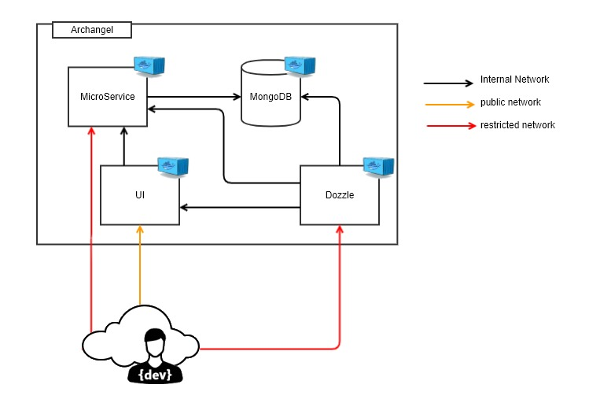

# ArchAngel

Archangel is a simple RESTful microservice example that consist of three working parts and a logging tool for development. 

Front-End/UI: This is the visual part of the project with a single dropdown containg a finite list of cars and Submit button.

MicroService: RESTful listener that will perform a search for any incoming json queries passed to it. In this instance, a car_model is passed, a query created and then the results of that car are returned. 

Datastore: A pre-seeded MongoDB (NOSQL) database is used to persist the document objects of each vehicle and it's details

The non-functional piece of the project is Dozzle, a logging engine that allows developers to see see the logfiles and troubleshoot any issues that may arise

### The Short and sweet

build the project with `./bootstrap`

then start it with `docker-compose up -d`

bootstrap accepts two arguments `clean` and `start`

clean will remove any existing containers

start will start all of the services after bulding them 


You can now point your browser to the IP the services were started on and it will come up. 
For example: 

```
http://localhost/
```

## Basic Block Model




